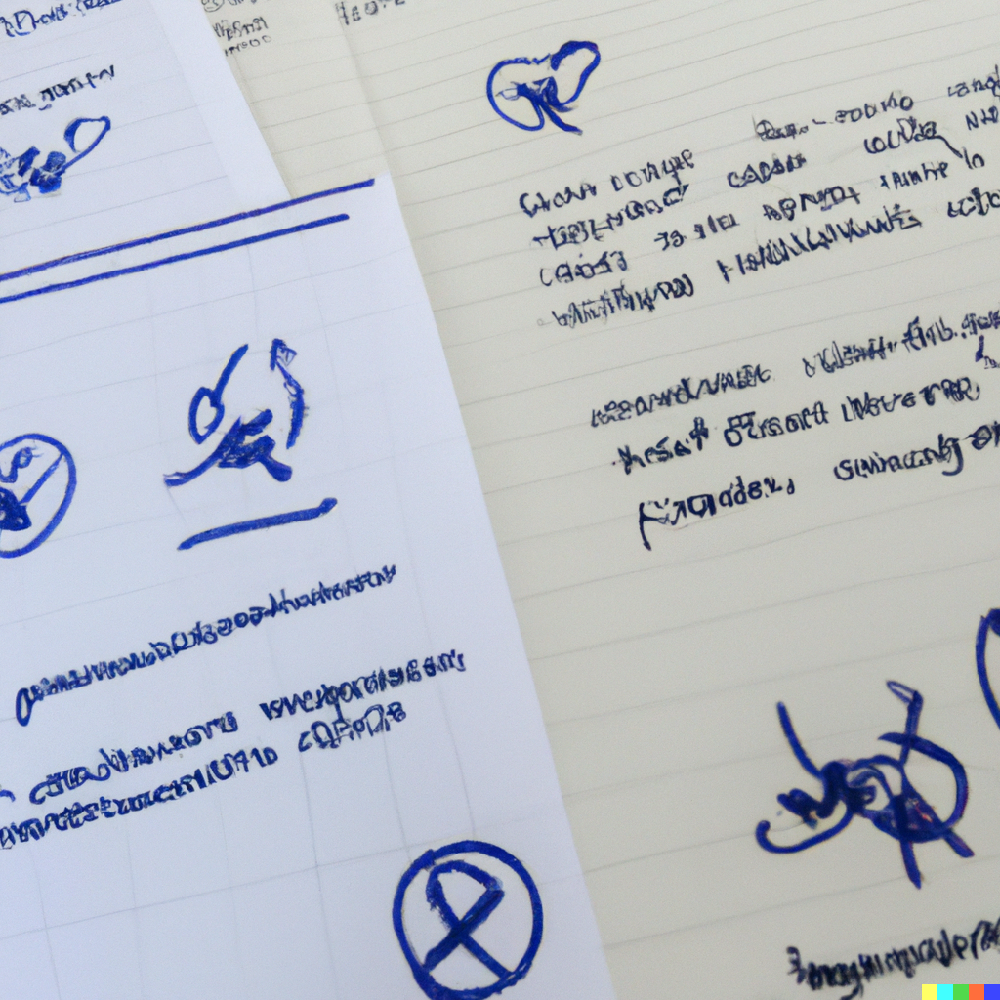

# Aprende Node.js y Express - Curso desde Cero

## Apuntes y ejercicios realizados durante el curso.

Curso en youtube por freeCodeCamp [Link](https://www.youtube.com/watch?v=1hpc70_OoAg&t=27025s&ab_channel=freeCodeCampEspa%C3%B1ol).

### Interpretacion de Dall-e hecha en algun momento durante la cursada

